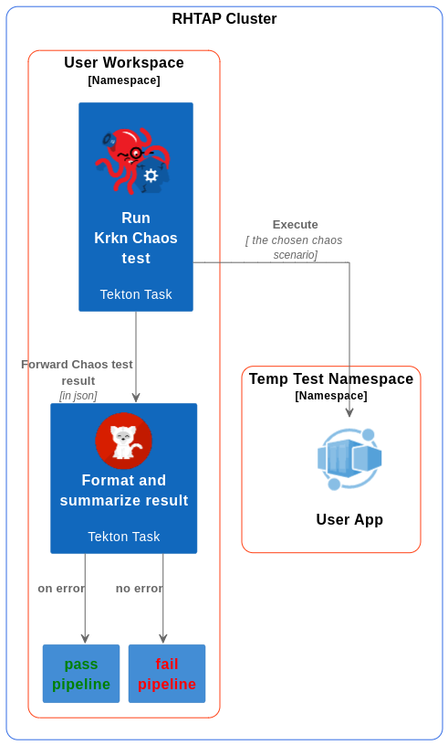
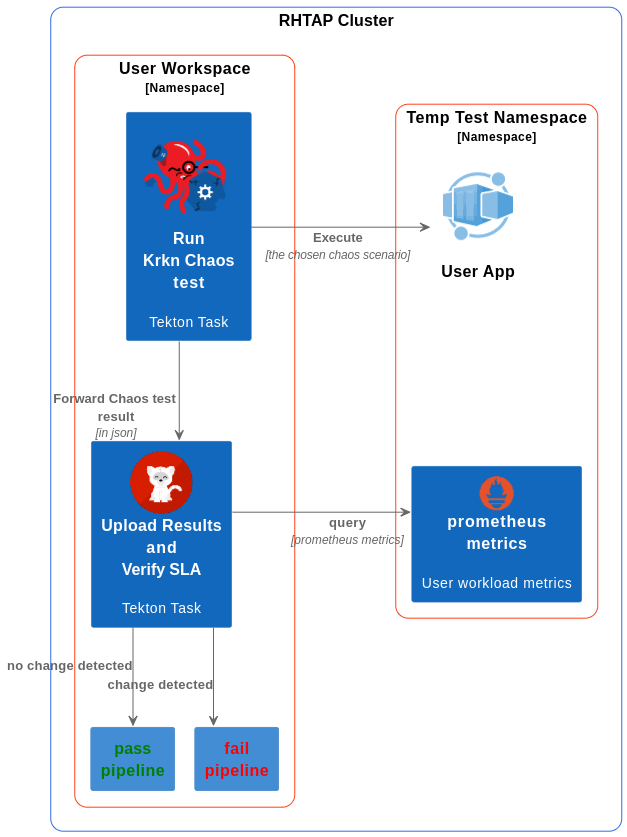

# 18. Continuous Chaos Testing of Apps in AppStudio

Date: 2024-03-05

## Status

In consideration

## Context

The chaos engineering strategy enables users to discover potential causes of service degradation. It helps users understand their app behavior under unpredictable conditions, identify areas to harden, and utilize performance data points to size and tune their application to handle failures, thereby minimizing downtime.

There are two approaches to chaos testing in the CI/CD pipeline.

### Resilience based Chaos scenario

These Chaos scenarios are expected to cause application failure. Example scenarios include simulating memory pressure, storage errors, killing random or dependent resources. The objective of these chaos test cases in the CI/CD pipeline is to assess whether the application is capable of mitigating and maintaining reliability.

### SLA based Chaos scenario

Test the resiliency of a application under turbulent conditions by running tests that are designed to disrupt while monitoring the application adaptability and performance:
Establish and define your steady state and metrics - understand the behavior and performance under stable conditions and define the metrics that will be used to evaluate the application’s behavior. Then decide on acceptable outcomes before injecting chaos.
Analyze the statuses and metrics of all components during the chaos test runs.
Improve the areas that are not resilient and performant by comparing the key metrics and Service Level Objectives (SLOs) to the stable conditions before the chaos. For example: evaluating the API server latency or application uptime to see if the key performance indicators and service level indicators are still within acceptable limits.

### Glossary

- krkn: Chaos testing framework: <https://github.com/krkn-chaos/krkn>

## Decision

The Knoflux user can run chaos tests such as Krkn as part of the IntegrationTestScenarios in the ephemeral environment and can gather Prometheus metrics from Thanos-querier-openshift-monitoring or Prometheus-k8s-openshift-monitoring endpoints.

## Consequences

The service account associated with the ephemeral environment will possess admin-level privileges to execute CRUD operations within the ephemeral namespace space. Using the service account token, it will be possible to authenticate and query Prometheus metrics from Thanos-querier-openshift-monitoring or Prometheus-k8s-openshift-monitoring endpoints.
